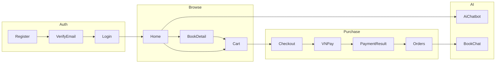

# BookVerse ? Stitch AI Design Brief

> T?i li?u mô t? to?n b? giao di?n hi?n có c?a **BookVerse** (web bán sách s?) ð? ð?a v?o **Stitch AI** thi?t k? l?i UI/UX.  
> Gi? nguy?n **lu?ng nghi?p v? v? t?n m?n h?nh**; t? do l?m m?i **visual design, layout, typography, illustration**.

---

## 1. T?ng quan s?n ph?m

| M?c | Mô t? |
|-----|--------|
| **T?n** | BookVerse |
| **Lo?i** | E-commerce bán sách s? (ebook/PDF) |
| **Ð?i t??ng** | Ð?c gi? Vi?t Nam & qu?c t?; admin qu?n lý kho sách |
| **Ngôn ng? UI** | Ti?ng Anh (to?n b? label, button, message) |
| **Ði?m khác bi?t** | AI g?i ý sách (chatbot), chat theo sách ð? mua, thanh toán VNPay |
| **Platform** | Web responsive (desktop-first, mobile-friendly) |
| **Theme** | Light / Dark toggle |

### Personas

1. **Guest** ? duy?t catalog, ðãng ký/ðãng nh?p  
2. **Customer** ? mua sách, gi? h?ng, checkout, ð?n h?ng, profile, AI chat  
3. **Admin** ? qu?n lý sách, danh m?c, ð?n, user, review, RAG catalog  

---

## 2. Brand & c?m giác th??ng hi?u (ð? xu?t cho Stitch)

### Hi?n tr?ng (tham kh?o, có th? ð?i ho?n to?n)

- Logo: icon sách m? + ch? **BookVerse**
- Accent: indigo `#4f46e5` (light), `#6366f1` (dark)
- N?n: slate xám nh?t `#f8fafc`
- C?m giác: th? vi?n s? hi?n ð?i, s?ch, tech-forward (có AI)

### Ð?nh h??ng thi?t k? m?i (g?i ý cho Stitch)

- **Warm literary** ? ?m, gi?y, typography serif cho ti?u ð? sách; sans-serif cho UI  
- **Premium bookstore** ? không gian sang, ?nh b?a l?n, nhi?u whitespace  
- **AI-native shop** ? gradient tinh t?, chip ?AI recommended?, chat bubble n?i b?t nh?ng không l?n át  

**Tone:** ðáng tin, d? ð?c, không quá ?startup generic purple?. ?u ti?n **b?a sách** l? hero visual.

---

## 3. Design system (tokens hi?n t?i ? có th? remap)

```
Colors (light):
  --bg: #f8fafc
  --surface: #ffffff
  --accent: #4f46e5
  --text: #0f172a
  --muted: #64748b
  --success: #10b981
  --error: #ef4444
  --warning: #f59e0b

Radius: 6px (sm) | 12px (md) | 16px (lg)
Shadows: sm / md / lg (soft elevation)
```

### Components c?n có trong design system Stitch

| Component | Variants / states |
|-----------|-------------------|
| **Button** | Primary, secondary, ghost, link; loading; disabled |
| **Input / Textarea / Select** | Label, placeholder, error, required |
| **BookCard** | Cover, title, author, price (sale + original strikethrough), Add to Cart overlay |
| **BookPrice** | Giá g?c g?ch ngang + giá sale khi có discount |
| **Badge** | Order status, stock, category |
| **Table** | Admin data tables + empty state |
| **LoadingState** | Spinner + text (?Loading books...?) |
| **EmptyState** | Text only (?No books found.?) |
| **ErrorState** | Message + Retry button |
| **Modal / ConfirmDialog** | Remove cart item, new chat session |
| **Toast** | Success / error notifications |
| **Pagination** | Previous, page numbers, Next |
| **OrderTimeline** | Vertical status history |
| **OrderStatusBadge** | PENDING_PAYMENT, PAID, PROCESSING, SHIPPED, DELIVERED, CANCELLED |

### Copy chu?n (English ? b?t bu?c gi?)

| Action | Label |
|--------|-------|
| Xem chi ti?t | **View** |
| S?a | **Edit** |
| L?u | **Save** |
| H?y form | **Cancel** |
| H?y ð?n | **Cancel Order** |
| Th? l?i | **Retry** |
| Ti?p t?c mua | **Continue Shopping** |
| Th?m gi? | **Add to Cart** |
| H?t h?ng | **Out of stock** |

**Search placeholder:** `Search by title or author`

---

## 4. S? ð? trang (Sitemap)

```
BookVerse
??? Public (MainLayout: Header + Footer)
?   ??? /                    Home / Catalog
?   ??? /books/:id           Book Detail
?   ??? /login               Login
?   ??? /register            Register
?   ??? /verify-email        Verify Email (OTP)
?   ??? /forgot-password     Forgot Password
?   ??? /reset-password      Reset Password
?
??? Customer (MainLayout + auth CUSTOMER)
?   ??? /cart                Shopping Cart
?   ??? /checkout            Checkout
?   ??? /payment/result      Payment Result (VNPay callback)
?   ??? /payment/success     Payment Success
?   ??? /payment/cancel      Payment Cancel
?   ??? /orders              My Orders
?   ??? /orders/:id          Order Detail
?   ??? /books/chat          AI Book Chat (purchased books)
?
??? Account (MainLayout + auth any)
?   ??? /profile             Profile & Password
?   ??? /profile/addresses   Shipping Addresses
?
??? Admin (AdminLayout: sidebar)
    ??? /admin               Dashboard
    ??? /admin/books         Book Inventory
    ??? /admin/books/new     Add Book
    ??? /admin/books/:id     Edit Book + Stock
    ??? /admin/categories    Categories
    ??? /admin/orders        Orders
    ??? /admin/orders/:id    Order Detail + Status actions
    ??? /admin/users         Users
    ??? /admin/reviews       Reviews
    ??? /admin/rag           RAG Catalog (AI indexing)
```

### Global chrome

**Header (customer/public):**
- Logo BookVerse ? `/`
- Nav: Home, AI Chat (customer only)
- Theme toggle (sun/moon)
- Cart icon + badge count (customer only)
- Auth: Log In + Register **ho?c** avatar dropdown (Profile, My Orders / Admin Dashboard, Log Out)

**Footer:**
- Brand blurb, social links (Facebook, Twitter, Instagram, GitHub)
- Columns: Explore, Support, Contact
- Links placeholder (About, FAQs, Policies?)

**Floating widget:**
- AI Chatbot button ??? AI Chat? (catalog pages, logged-in customer)

**Admin sidebar:**
- Dashboard, Books, Categories, Orders, Users, Reviews, RAG Catalog, Logout

---

## 5. Chi ti?t t?ng m?n h?nh

### 5.1 Home / Catalog ? `/`

**M?c ðích:** Trang ch?, duy?t v? t?m sách.

**Layout:**
1. **Hero banner** ? H1 ?Explore BookVerse?, subtitle v? th? vi?n s? + AI  
2. **Filters bar** ? Search, Category dropdown, Sort dropdown  
3. **Result meta** ? ?Showing 1?20 of 44 books?  
4. **Book grid** ? responsive (4 col desktop ? 2 col tablet ? 1 col mobile)  
5. **Pagination**

**BookCard (m?i ô):**
- ?nh b?a (click ? detail)
- Overlay **Add to Cart** (hover desktop / luôn hi?n mobile); disabled ?Out of stock? khi stock = 0
- Title (link), Author
- **BookPrice:** giá sale + giá g?c g?ch ngang (n?u có discount)
- **Không** hi?n th? badge ?Out of stock? tr?n card

**States:** Loading books? | Error + Retry | Empty ?No matching books found.?

---

### 5.2 Book Detail ? `/books/:id`

**Layout 2 c?t:**
- Trái: cover l?n  
- Ph?i: category badge, title, author, **Purchase options** (BookPrice), stock badge (?Available now? / ?Out of stock? + s? l??ng), **Add to Cart**, mô t? d?i  

**Actions:** Back to home page, Add to Cart

---

### 5.3 Auth flows

| Trang | N?i dung chính |
|-------|----------------|
| **Login** | Email, Password, Login, links Register / Forgot password; banner registered/reset success |
| **Register** | Full name, email, password, confirm ? verify email |
| **Verify Email** | OTP input, Verify, Resend OTP |
| **Forgot Password** | Email ? g?i OTP |
| **Reset Password** | New password + confirm |

**Layout:** narrow centered form (`max-width ~480px`), H1, field errors inline.

---

### 5.4 Cart ? `/cart`

- Checkbox ch?n t?ng item / ch?n t?t c?  
- M?i row: cover thumbnail, title, unit price, quantity stepper, line total, remove  
- Footer: selected subtotal, **Checkout** (ch? items ð? ch?n), **Continue Shopping**  
- Empty: ?Your cart is empty.? + Continue Shopping  
- Confirm dialog khi xóa item  

---

### 5.5 Checkout ? `/checkout`

**2 c?t:**
- Trái: ch?n ð?a ch? có s?n **ho?c** form ð?a ch? m?i (Recipient, Phone, Line, Ward, District, City)  
- Ph?i: **CheckoutSummary** ? danh sách item, subtotal, shipping fee, total, nút Pay (redirect VNPay)  

**Address placeholders:** Recipient name, Phone number, Street address, Ward, District, City

---

### 5.6 Payment Result ? `/payment/result` | `/payment/success` | `/payment/cancel`

**Card trung tâm, 3 states:**
1. **Loading** ? spinner ?Verifying Payment?  
2. **Success** ? icon xanh, ?Payment Successful!?, buttons Home + Orders  
3. **Failed** ? icon ð?, ?Payment Failed?, buttons Home + Orders  

---

### 5.7 Orders ? `/orders`

- Table: Order ID, Status badge, Total, **View** link  
- Empty: ?No orders yet? + **Continue Shopping**  
- Loading / Error + Retry  

### 5.8 Order Detail ? `/orders/:id`

- Order #id + status badge  
- Shipping address panel  
- Items table (title, qty, line total)  
- Total amount  
- **OrderTimeline** ? l?ch s? tr?ng thái  

**Admin overlay** (`/admin/orders/:id`): th?m panel ?Status Management? ? Process, Ship, Deliver, **Cancel Order**

---

### 5.9 Profile ? `/profile`

- Form: Full name ? **Save**  
- Form ð?i m?t kh?u: current, new, confirm ? **Save** / ?Change password?  
- Link t?i Addresses  

### 5.10 Addresses ? `/profile/addresses`

- List ð?a ch? + Edit / Delete / Set default  
- Form th?m/s?a d?ng AddressForm, submit **Save**  

---

### 5.11 AI Book Chat ? `/books/chat`

**Layout chat 3 v?ng:**
1. **Sidebar** ? ?+ Start New Chat?, danh sách session (title + date), empty ?No chat history found.?  
2. **Main chat** ? bubble user/assistant (markdown), input ?Ask a question??, Send  
3. **Modal** t?o chat m?i ? ch?n sách ð? mua, optional title  

*Ch? customer ð? mua sách m?i chat ð??c.*

---

### 5.12 AI Chatbot (floating) ? m?i trang catalog

- FAB ??? AI Chat? góc m?n h?nh  
- Panel chat: bot ch?o, user h?i, bot tr? l?i + **book recommendation cards** (cover, title, price, **View**, Add to Cart)  
- Input: ?Describe the book you want to find??  

---

## 6. Admin screens

### 6.1 Dashboard ? `/admin`

4 stat cards: **Users**, **Books**, **Orders**, **Revenue** (VND format)

### 6.2 Book Inventory ? `/admin/books`

- Header: H1 + **+ Add Book**  
- Filters: Status (All / Active / Hidden), Sort  
- Table: ID, Title, Author, Category, Price, Stock, Status, Actions (**Edit**, **Hide** / **Show**)  
- Pagination  
- Empty: ?No books found.?

### 6.3 Add Book ? `/admin/books/new`

Form: Title*, Author*, Category*, cover upload, book file upload (PDF/EPUB)*, **PricingFields** (Original Price, Discount %, computed Price), Stock*, ISBN, Description ? **Cancel** / **Save**

### 6.4 Edit Book ? `/admin/books/:id`

Gi?ng Add + section **Stock** ri?ng:
- Current Stock (read-only)  
- Adjust by (+/-), Note, **Save**  

### 6.5 Categories ? `/admin/categories`

- Input ?Enter category name? + **Add**  
- Table: ID, Name, Slug  
- Empty: ?No categories found.?

### 6.6 Orders ? `/admin/orders`

- Sort dropdown  
- Table: Order ID, Customer, Date, Status, Total, **View**  
- Empty: ?No orders found.?

### 6.7 Users ? `/admin/users`

- Table: Email, Name, Status (Active/Locked), **Lock** / **Unlock**  
- Empty: ?No users found.?

### 6.8 Reviews ? `/admin/reviews`

- Table: User, Rating, Content, **Delete**  
- Empty: ?No reviews found.?

### 6.9 RAG Catalog ? `/admin/rag`

- Search ?Search by title or author?  
- Bulk actions: ingest / delete index  
- Table: checkbox, book info, RAG status cells, health indicator  
- Empty: ?No books found.?

---

## 7. User flows chính (gi? logic khi redesign)



1. **Mua sách:** Catalog ? Detail ? Add to Cart ? Cart ? Checkout ? VNPay ? Payment Result ? Orders  
2. **Ðãng ký:** Register ? Verify Email ? Login  
3. **AI:** Chatbot t?m sách tr?n catalog **ho?c** Book Chat v?i sách ð? mua  

---

## 8. Responsive & accessibility

| Breakpoint | Ghi chú |
|------------|---------|
| Desktop ?1024px | Grid 4 c?t, sidebar admin c? ð?nh |
| Tablet 768?1023px | Grid 2?3 c?t, admin sidebar có th? collapse |
| Mobile &lt;768px | Grid 1?2 c?t, hamburger nav, cart button luôn hi?n tr?n BookCard |

- Focus states r? tr?n inputs/buttons  
- `aria-label` cho cart, theme toggle  
- Contrast ð?t WCAG AA cho text chính  

---

## 9. R?ng bu?c k? thu?t (không ð?i khi redesign)

- React + Vite frontend; API REST `/api/v1`  
- Roles: `CUSTOMER`, `ADMIN` ? admin không th?y cart / add to cart  
- Pricing: `price` = `originalPrice × (1 - discount%/100)`; hi?n th? sale khi `originalPrice > price`  
- Thanh toán: redirect external VNPay URL  
- Upload admin: cover image + PDF/EPUB qua MinIO  
- Ti?n t?: VND (`120.000 ?` style)  

---

## 10. Prompt m?u cho Stitch AI

Copy t?ng block d??i ðây v?o Stitch ð? generate t?ng m?n:

### Prompt 1 ? Design system
```
Design a complete design system for "BookVerse", a modern digital bookstore web app with AI book recommendations. Include light and dark themes. Style: warm literary meets premium e-commerce. Primary use case: browsing book covers in a grid. Components: buttons, inputs, book card with cover image and sale pricing, badges, data tables, empty/loading/error states, chat widget. English UI labels. Colors should feel bookish but contemporary?not generic purple SaaS.
```

### Prompt 2 ? Homepage / Catalog
```
Design the homepage for BookVerse online bookstore. Hero: "Explore BookVerse" with subtitle about AI-assisted discovery. Below: search bar placeholder "Search by title or author", category filter, sort dropdown. Main area: responsive grid of book cards?each shows cover, title, author, original price struck through and sale price, hover Add to Cart button. Footer with brand, explore links, support links. Include header with logo, Home, cart icon with badge, login/register. Light and dark mode.
```

### Prompt 3 ? Book detail
```
Design book detail page for BookVerse. Two columns: large book cover left; right side has category tag, title, author, price with discount, stock availability badge, prominent Add to Cart button, long description section. Breadcrumb or back link "Back to home page". Clean typography optimized for long book titles.
```

### Prompt 4 ? Cart & Checkout
```
Design shopping cart and checkout for BookVerse. Cart: selectable rows with cover thumbnail, quantity controls, subtotal, Checkout and Continue Shopping buttons. Checkout: address selector + new address form on left, order summary with shipping fee and Pay button on right. Empty cart state. English labels: Save, Cancel, Continue Shopping.
```

### Prompt 5 ? Admin dashboard
```
Design admin dashboard for BookVerse bookstore. Left dark sidebar: Dashboard, Books, Categories, Orders, Users, Reviews, RAG Catalog, Logout. Main: 4 KPI cards (Users, Books, Orders, Revenue in VND). Then design the Books inventory page: table with filters Active/Hidden, Edit and Hide actions, Add Book button. Professional admin UI, distinct from customer storefront.
```

### Prompt 6 ? AI Chat
```
Design AI book assistant for BookVerse. Floating chat button bottom-right. Chat panel with bot messages and book recommendation cards (cover, title, price, View and Add to Cart). Separate full-page Book Chat with session sidebar and markdown message area for discussing purchased ebooks.
```

---

## 11. Deliverables mong ð?i t? Stitch

- [ ] Design system (colors, type, spacing, components)  
- [ ] Desktop + mobile frames cho **t?t c? m?n** trong m?c 4  
- [ ] Light + Dark variant cho storefront (ít nh?t catalog + detail + cart)  
- [ ] Admin shell ri?ng bi?t v?i customer storefront  
- [ ] Prototype flow: Browse ? Detail ? Cart ? Checkout ? Payment success  

---

## 12. Tham chi?u code (dev team)

| Khu v?c | Th? m?c |
|---------|---------|
| Routes | `src/routes/AppRoutes.jsx` |
| Customer layout | `src/layouts/MainLayout.jsx`, `Header.jsx`, `Footer.jsx` |
| Admin layout | `src/layouts/AdminLayout.jsx` |
| Pages | `src/pages/**` |
| Components | `src/components/**` |
| Styles | `src/styles/global.css` |

---

*T?i li?u sinh t? codebase BookVerse Frontend ? nhánh `dev`. C?p nh?t khi th?m m?n h?nh m?i.*
